# 概要

## これまでの実験方針

年末のミーティングでお話ししたように、これまでは

1. roll = 0で2組のエタロンどうしの平行からの角度差 ($α$) を調節
   1. 干渉の結果からαを推定
2. roll 角度を $\delta\neq0$ にして重力の寄与を測定
   1. λ & (I_H - I_O) / (I_H + I_O) の振動をフーリエ変換
   2. ピーク位置のフーリエ成分から重力加速度を逆算

という手法で実験を試みる方針でした。

## 使用できるroll角度

### $\lambda$ に比例する効果がない場合

事前シミュレーションとして、波動関数から計算した確率分布によって λ & (I_H - I_O) / (I_H + I_O) の振動をフーリエ変換した結果、表のようになりました。

| roll $\delta$ | Fourier成分理論値 | Fourier成分取得値 | 理論値とのズレ | 取得重力加速度 |
| - | - | - | - | - |
| 90deg | -6.08437e11 | -6.0061e11 | **0.9871** | **9.67** |
| 60deg | -5.26922e11 | -5.1900e11 | **0.9849** | **9.65** |
| 30deg | -3.04218e11 | -2.9687e11 | **0.9758** | **9.56** |
| 10deg | -1.05654e11 | -8.5065e11 | **0.8051** | **7.89** |
| 5deg | -5.30287e10 | -2.0448e10 | **-.3856** | **-3.78** |

特にフーリエ変換したグラフからピークを求めようとすると、
rollは大きければ大きい方がいいということがわかります。

実際、$\delta\leq10\deg$ ではバックグラウンドとかぶっています。
以下、上から順に $\delta = 0, 5 \deg, 10 \deg, 30 \deg$ です。

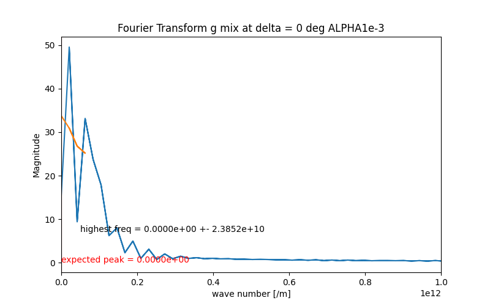

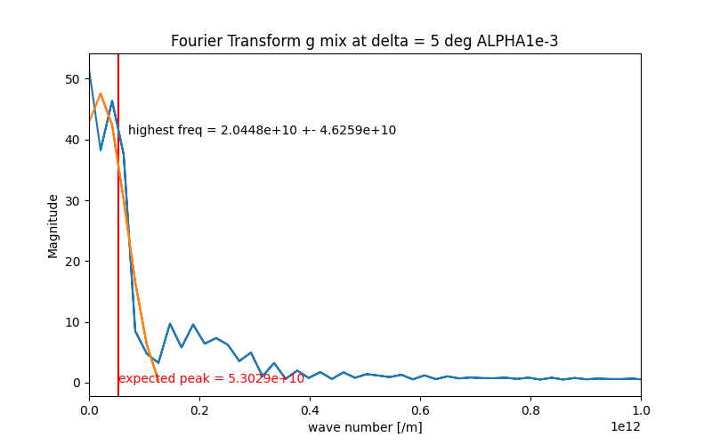

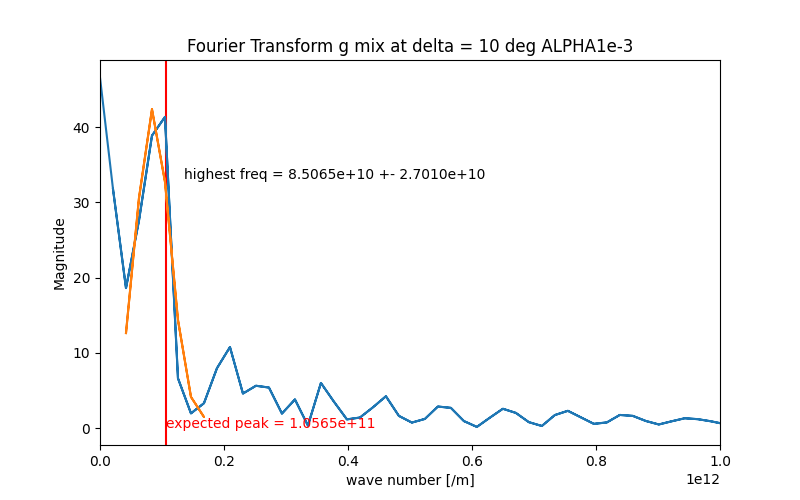

### $\lambda$ に比例する効果を入れた場合

同様に波動関数を計算すると、ピーク位置が右へずれます。
特に $\alpha$ を大きくしていくとピークが下がりながら右へずれていくので、測定自体に$10^3\deg$ オーダーの精度が要求されます。
以下、例として $\delta = 30\deg$ です。

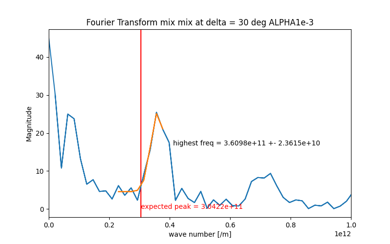

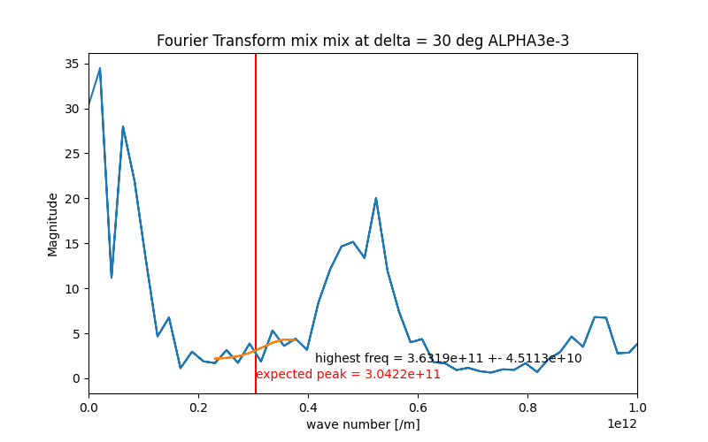

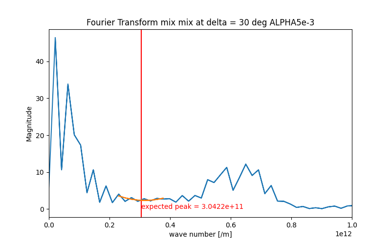

また、$\alpha$ 固定で $\delta$ を下げるとピークの高さが下がるので、ノイズとの判別が難しくなる恐れがあります。

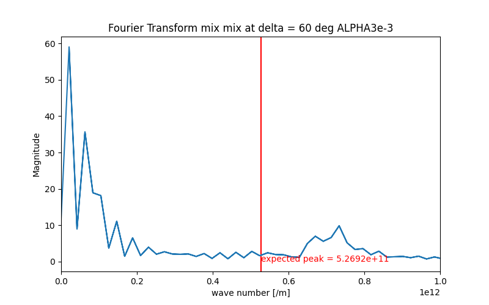

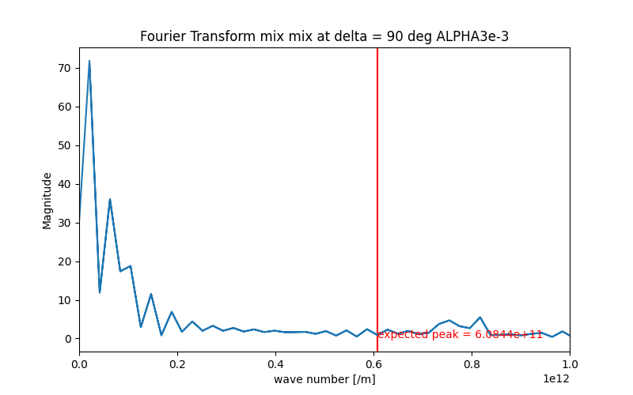

## 今後の方針

以上を踏まえ、ピークがバックグラウンドから分離され、かつ高く出る $\delta=30\deg$ にて実験することが妥当だと考えています。
これに対しゴニオステージは±5ºしか稼働しないため、必然的に実験方針1. ($\delta=0$ にて $\alpha$ を調節) ができなくなります。

このままではrollの角度が不明になるわけですが、解決策として、$\alpha\neq0$ では短波長成分が含まれることに注目し、

1. 高周波数成分を低周波側に寄せるように $\alpha$ を調整
2. 反射して左に寄り切るタイミングでピーク位置のフーリエ成分から重力加速度を逆算

とすることを考えています。

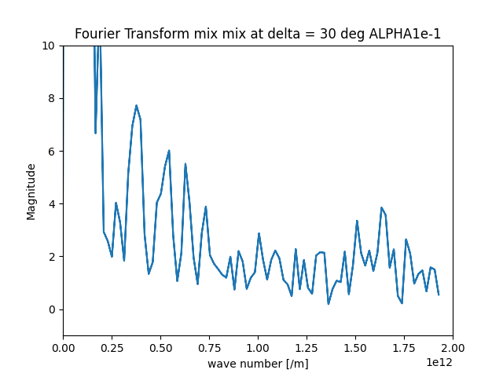

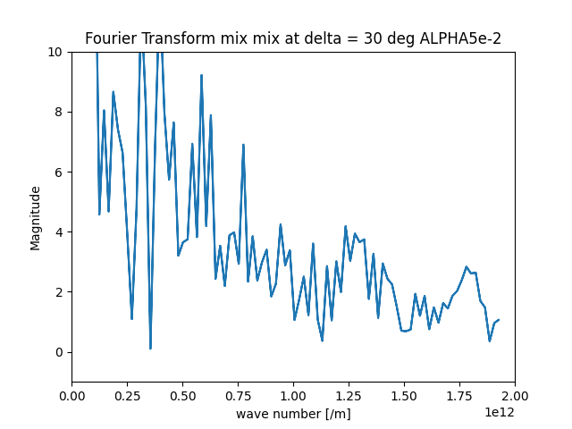

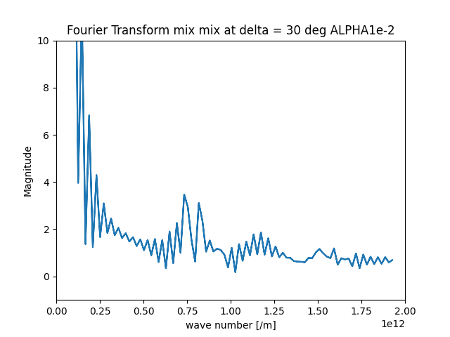

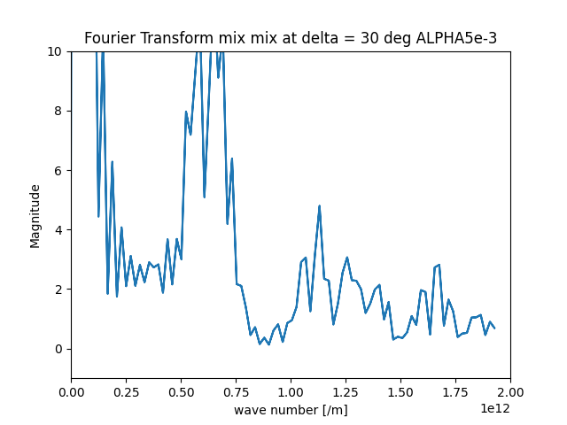

フーリエ成分では確認が難しくても、実際に得られるデータを見ればある程度調整は可能だと踏んでいます。

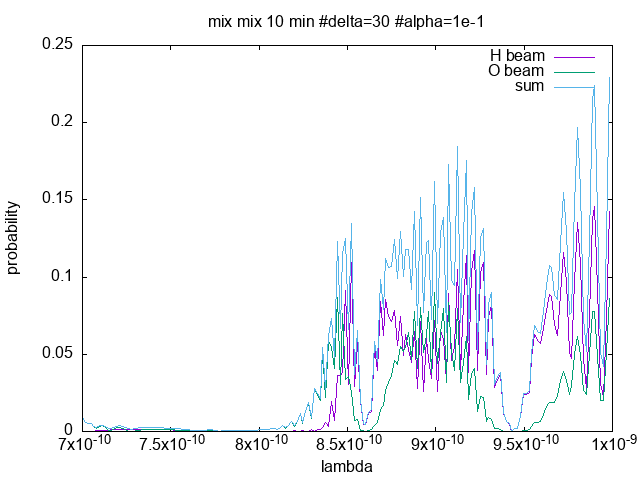

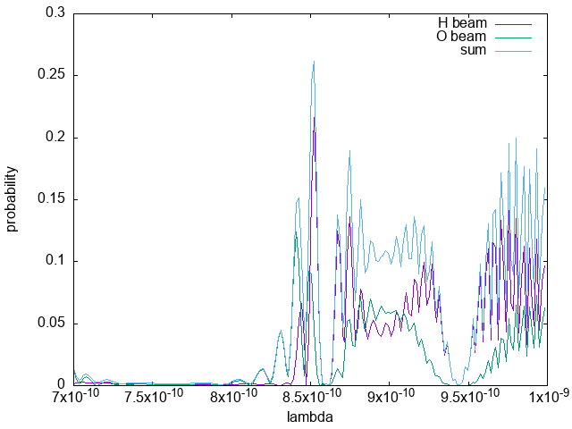

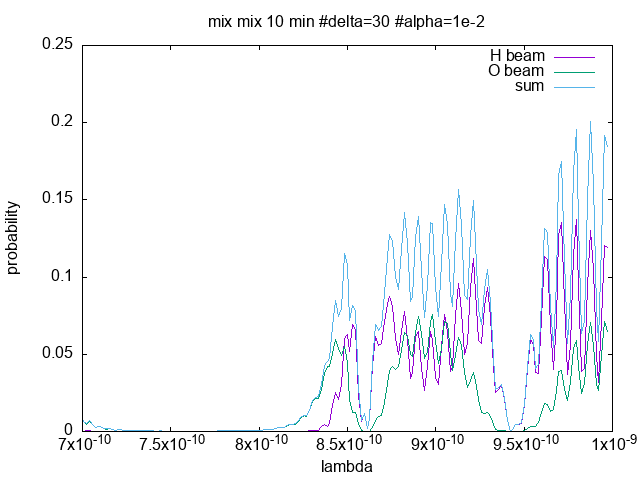

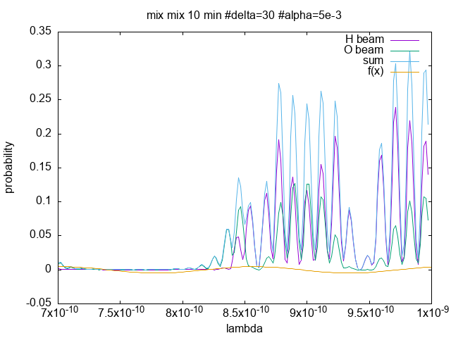
